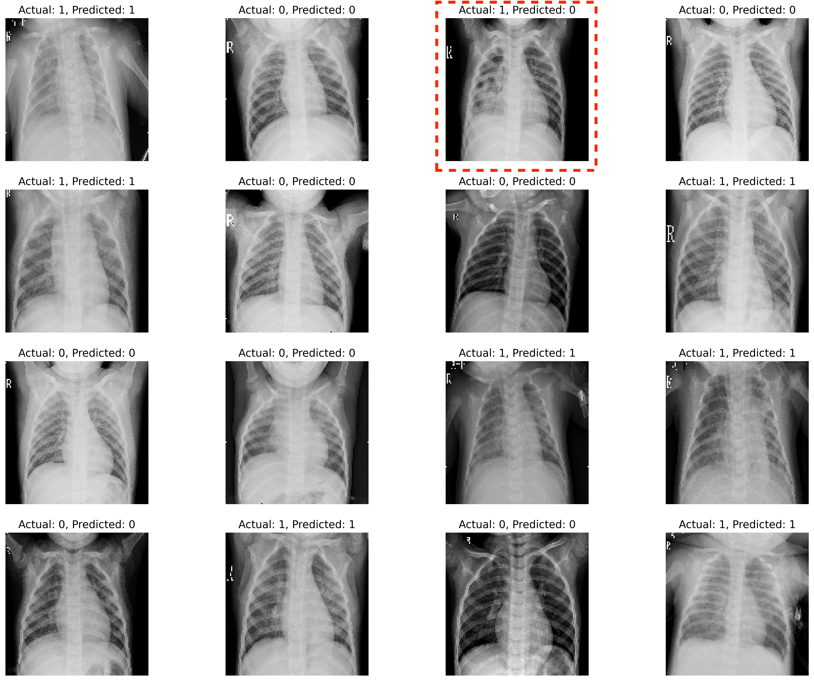
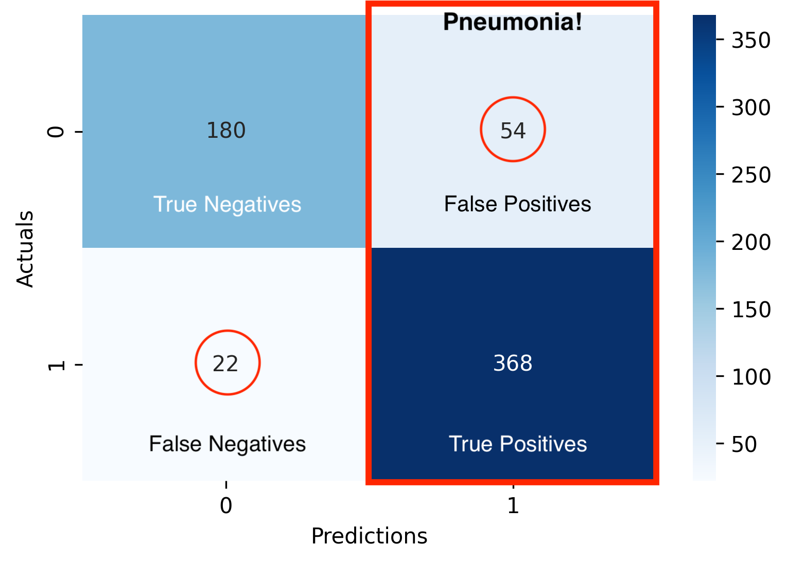

# Pneumonia Detection from Chest X-ray through Deep Learning
Author: [JingYun (Jonna) Wang](/jingyunwang24@gmail.com)
<br>


## Overview
This project uses convolutional neural networks (CNN) for chest x-ray image classification to identify whether patients have pneumonia or not. The data contains normal and pneumonia x-ray images. Rather than sending every image to doctors, the radiology department can use my model to filter pneumonia x-ray images.

## Business Problem
Working for a radiology department, my job is to build a machine learning model which can classify the chest x-ray and predict unseen images as either pneumonia or normal, thus improve the efficiency of the department and release the burden for doctors during peak time.

## Data
The dataset acquired from [Kaggle](https://www.kaggle.com/paultimothymooney/chest-xray-pneumonia) is organized into 3 folders (train, test, val) which contain sub-folders for each image category (Pneumonia/Normal). There is a total of 5,856 x-ray images (JPEG). 

## Methods
This project use CNN for image classification and train-test-val split to evaluate machine learning performance.

## Model Evaluation
Overall, pretrained VGG19 has the highest accuracy and f1-score, however, it's computational cost expensively without GPU processing. So I choose 5 blocks (b5m) as my best model.

|  Model | Test Accuracy | F1-Score | Choice |
| :---: | :---: |:---: | :---: |
| Baseline | 74.84% | 0.50 | 
| 5 blocks (b5m) | 87.82%| 0.83 | ✓|
| Pretrained VGG19 | 89.42%| 0.85|

<br>

## Results
- Evaluation on holdout set
<br>



|   Model| Accuracy |
| :---: | :---: |
| 5 blocks (b5m) | 93.75%|

<br>

## Why use a threshold?



In the real situation, if the model predicts the result to be pneumonia (both true positives and false positives), then the x-rays images will be sent to doctors and look through again to see how severe the condition is. Misclassifying someone to be non-pneumonia (false negatives) will cause delay or lack of supportive treatments. To solve the misclassify issue, I set a threshold for predicting probabilities. For probabilities within the range, those images can be sent to medical intern students for preview (also work as a practice for them). So that, if it is pneumonia, then re-send to the doctor for final review.

<br>
<b>Predicting Probabilities</b>

- probability of having pneumonia that generates for each sample prediction

## Conclusion
Among analyze 5,856 chest x-ray images, a convolutional neural network was built for image classification. After hyperparameter tunning, my best model's test accuracy has reached 87.82%. Rather than sending every x-rays image to doctors, the radiology department can use my model to filter "pneumonia" and "normal" x-ray images. There is a small chance that the machine will predict incorrectly. Setting a threshold can help to find out those misclassified x-rays images. 
***

### Recommendation
- <b>Image size</b>: Saved the x-ray images' size as 128×128 px before feeding into the model
- <b>Threshold</b>: p = probability of having pneumonia
    - p ≥ 50%: send the images to doctors for further diagnosis. 
    - p < 50%: send the images to medical intern students to find out false negatives.
 

## Future Work
Further analysis can be explored on the following to provide additional insights and improve the model performance.

- <b>Data</b>: Acquire more normal chest x-ray images to see if can reduce false positives
- <b>Model structure</b>:Try different model architectures and hyperparameter tunning
- <b>Extensive application</b>: Further developed model for other disease dectection (which needs x-ray images)

## For More Information
See the full analysis and modeling in the [Jupyter Notebook](./Notebook.ipynb) and [presentation](./Presentation.pdf).
For additional information please contact, JingYun (Jonna) Wang at jingyunwang24@gmail.com

## Repository Structure
```
├── additional
├── images
├── Notebook.ipynb
├── Presentation.pdf
└── README.md
```